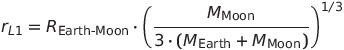
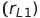
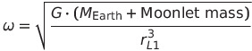
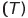
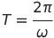
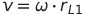

# Lagrange Point L1 Calculation and Orbital Parameters

## Lagrange Point L1 Calculation

The position of Lagrange point L1 is calculated using the formula:

This formula determines the distance from the smaller object (moonlet) to Lagrange point L1, considering the gravitational influences of the Earth and Moon.

## Orbital Parameters at Lagrange Point L1

Once we have the distance to Lagrange point L1 , we can calculate the orbital parameters such as angular velocity , orbital period, and orbital speed.

### Angular Velocity (\(\omega\))

The angular velocity  is determined by the centripetal acceleration formula:

### Orbital Period (\(T\))

The orbital period  is the time it takes for the moonlet to complete one orbit at Lagrange point L1 and is computed as the inverse of the angular velocity:

### Orbital Speed (\(v\))

The orbital speed (\(v\)) is the linear speed of the moonlet at Lagrange point L1 and is given by multiplying the angular velocity (\(\omega\)) by the distance to Lagrange point L1 :

These formulas are based on principles of orbital mechanics and centripetal acceleration, considering the gravitational forces between the Moon, Earth, and the moonlet.