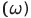

# Derivation of Lagrange Point L2 Formula

## Gravitational Forces

At the Lagrange point L2, the gravitational forces from the Earth and the Moon add up to provide a net force that is directed toward the Lagrange point. Mathematically, this can be expressed as:

Where:

## Centripetal Force

For an object in circular orbit at the Lagrange point L2, the centripetal force is provided by the gravitational forces. The centripetal force is given by the formula:

Where:
-  is the angular velocity.
- 
## Setting Forces Equal

Setting the gravitational forces equal to the centripetal force and solving for  gives the Lagrange point distance formula:

## Lagrange Point L2 Formula

Solving for , we get the formula to sovle for Lagrange Point 2:

This formula gives the distance from the center of mass of the Earth-Moon system to the Lagrange point L2 for a moonlet of mass .