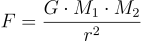
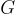
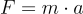
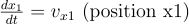
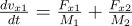
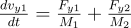
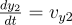
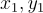
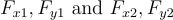
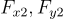

### Gravitational Force Calculation

The force between two masses due to gravity is given by Newton's law of gravitation:

Where:
-  is the gravitational force,
-  is the gravitational constant,
-  and  are the masses of the two objects,
-  is the distance between the centers of the masses.

### Equations of Motion

The differential equations that describe the motion of each moonlet are derived from Newton's second law:

For each moonlet, we have four differential equations:

1. 
2.  (position y1)
3.  (velocity x1)
4.  (velocity y1)

5.  (position x2)
6.  (position y2)
7.  (velocity x2)
8.  (velocity y2)

Where:
-  are the positions of the first moonlet,
-  are its velocities,
-  are the gravitational forces acting on the first moonlet,
-  is the mass of the first moonlet.
- Similar expressions hold for the second moonlet.

### Gravitational Forces Between Moonlets

In the equations,  represent the gravitational forces between moonlets. The forces are calculated as follows:

-  are the gravitational forces on moonlet 1 due to the Earth and moonlet 2.
-  are the gravitational forces on moonlet 2 due to the Earth and moonlet 1.

The positions used to calculate the distances between the moonlets and the Earth are adjusted for the relative positions of the moonlets.

### Simulation

The `odeint` function is then used to solve these differential equations numerically over a specified time span, and the resulting positions and velocities are recorded at discrete time intervals. The simulation advances in time steps, updating the positions and velocities based on the gravitational interactions between the Earth and moonlets and between the moonlets themselves.