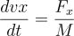

### Gravitational Force Calculation:

The gravitational force acting on a celestial body at position  due to another body at the origin is given by Newton's law of gravitation:

where:
-  is the gravitational constant,
-  is the mass of the celestial body (Earth or Moon),
-  is the distance between the celestial bodies.

### Equations of Motion:

The motion of the celestial bodies is described by a system of differential equations, derived from Newton's second law:

where:
-  are the coordinates of the body,
-  are the components of the velocity,
-  is the mass of the body,
-  and  are the components of the gravitational force.

### Lagrange Point Location Calculation:

The location of Lagrange point L5 is calculated using the following formulas:

Here,  is the angle that changes with time, and it's updated based on the Moon's orbital period.

### Simulation:

The simulation integrates the equations of motion using the `odeint` function from the `scipy` library. It calculates the positions and velocities of the Moon, two moonlets, and Lagrange point L5 at each time step.