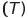
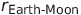

# Lagrange Point L2 Calculation and Orbital Parameters

## Lagrange Point L2 Calculation

The position of Lagrange point L2 is determined by finding a point along the line connecting the two massive bodies (Earth and Moon), beyond the smaller object (Moon). The formula for the distance to Lagrange point L2 is given by:

This formula is derived from the gravitational forces and accelerations acting on the smaller object (Moonlet) due to the Earth and Moon.

## Orbital Parameters at Lagrange Point L2

Once we have the distance to Lagrange point L2 , we can calculate the orbital parameters such as angular velocity , orbital period, and orbital speed.

### Angular Velocity 

### Orbital Period 

The orbital period  is computed as the inverse of the angular velocity:

### Orbital Speed 

The orbital speed  is given by multiplying the angular velocity  by the distance to Lagrange point L2 :

These formulas are based on the principles of orbital mechanics and centripetal acceleration, taking into account the gravitational forces between the Moon, Earth, and the moonlet.

## Derivation of Lagrange Point L2 Formula

The Lagrange points are locations in space where the gravitational forces of two large bodies, such as a planet and its moon, combine in such a way that a smaller object, like a satellite or moonlet, experiences relatively stable gravitational equilibrium with the two larger bodies.

### Gravitational Forces

The gravitational force between the smaller object (moonlet) and the larger bodies (Earth and Moon) is given by Newton's law of gravitation:

Here,  is the mass of the smaller object, and  is the distance between Earth and Moon.

### Centripetal Force

The centripetal force required to keep the smaller object in orbit around the combined center of mass of Earth and Moon is given by:

where  is the angular velocity and  is the distance to Lagrange point L2.

### Equilibrium Condition

At Lagrange point L2, the gravitational forces and centripetal force are balanced. Setting the gravitational forces equal to the centripetal force, we get an equation:

Substituting the expressions for gravitational forces and centripetal force, and simplifying, we arrive at the Lagrange point L2 distance formula:

This formula represents the distance from the smaller object (moonlet) to Lagrange point L2 in terms of the masses of Earth and Moon and the distance between Earth and Moon.